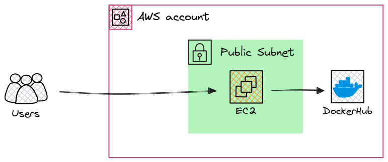

## Project Concept

This project covers the full lifecycle of deploying a containerized web application on AWS. It includes designing a custom VPC with subnets and routing, securing resources with Security Groups, launching and configuring an EC2 instance, installing Docker and Docker Compose, and deploying a Docker image from Docker Hub for a browser‑based application.

## Project Overview

The solution consists of the following key elements:

- **VPC & Networking**: Dedicated VPC with a public subnet, Internet Gateway, and routing rules.
- **Security**: Security Group allowing SSH for administration and your chosen application traffic port.
- **Compute**: EC2 instance launched in the public subnet; Docker and Docker Compose installed.
- **Container Deployment**: Running the `pengbai/docker-supermario:latest` image to serve the application.

## Architecture Diagram



## Components & File Structure

- **VPC & Subnet**  
  Create a VPC with public subnet.

- **Internet Gateway & Route Table**  
  Attach an Internet Gateway and configure a route table for outbound Internet access.

- **Security Group**  
  Define inbound rules for SSH and choose a port for application traffic.

- **EC2 Instance**  
  Launch an EC2 instance in the public subnet. Install Docker & Docker Compose to orchestrate the container.

- **Docker Image**  
  Pull `pengbai/docker-supermario:latest` from Docker Hub and run it via Docker Compose.

## Deployment (AWS Console)

1. **Network Setup**  
   Use the AWS Console to create the VPC, subnet, Internet Gateway, and route table.

2. **Security Group**  
   Create a Security Group with rules for SSH and your chosen application port.

3. **Launch EC2**  
   Select an AWS AMI, place it in the public subnet, and attach the Security Group.

4. **Instance Configuration**  
   Install Docker & Docker Compose — either automatically via EC2 User Data or manually through the terminal—and create a Docker Compose file mapping the container’s internal port to a host port.

## Local Testing

```bash

docker pull pengbai/docker-supermario:latest


docker run --rm -p <HOST_PORT>:<CONTAINER_PORT> pengbai/docker-supermario:latest
```

- `docker pull` downloads the Super Mario emulator image from Docker Hub.
- `--rm` automatically removes the container when it stops.
- `-p <HOST_PORT>:<CONTAINER_PORT>` maps a port on the host to the container’s internal port.
- After running, open `http://localhost:<HOST_PORT>` to verify the application.

## Final Thoughts

Congratulations on completing this project! You’ve successfully configured AWS networking and security, launched and prepared an EC2 instance, and deployed a containerized application from Docker Hub. These achievements lay the groundwork for more advanced cloud-native development and operations—keep exploring and building on these skills.

<p align="center">
  
</p>


